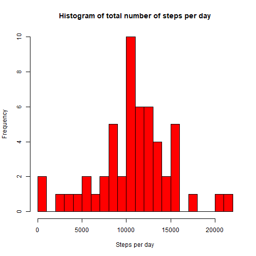
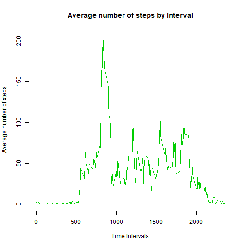
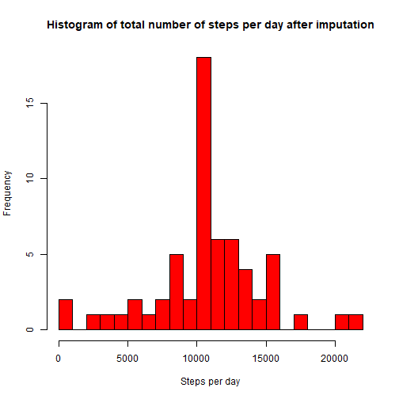
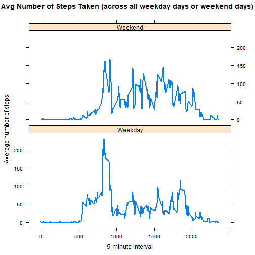

## Loading and preprocessing the data

For this part of the assignment, you can ignore the missing values in the dataset.  

1.  Calculate the total number of steps taken per day  
2.  If you do not understand the difference between a histogram and a barplot, research the difference between them. Make a histogram of the total number of steps taken each day  
3.  Calculate and report the mean and median of the total number of steps taken per day  

First I will load the data, change the format of the date column into dates and remove any NAs in the steps column.


```r
data <- read.csv("activity.csv")
data$date <- as.Date(data$date)
data_no_NAs <- data[!rowSums(is.na(data["steps"])), ]
```

I then need to group the results into individual days, before plotting the histogram


```r
steps_pd <- aggregate(steps ~ date, data_no_NAs, sum)
hist(steps_pd$steps,main = "Histogram of total number of steps per day", xlab = "Steps per day", col = "red", breaks = 20)
```



Finally, calculate the mean and median.


```r
paste("Mean steps = ", round(mean(steps_pd$steps),0))
```

```
## [1] "Mean steps =  10766"
```

```r
paste("Median steps = ", round(median(steps_pd$steps),0))
```

```
## [1] "Median steps =  10765"
```

## What is the average daily activity pattern?  


  1.  Make a time series plot (i.e. type = "l") of the 5-minute interval (x-axis) and the average number of steps taken, averaged across all days (y-axis)  
  2.  Which 5-minute interval, on average across all the days in the dataset, contains the maximum number of steps?  
  
First I need to regroup the data into time intervals, take the average number of steps and plot the graph.
  

```r
steps_int <- aggregate(steps ~ interval, data_no_NAs, mean)
plot(steps_int$interval, steps_int$steps, type='l', col=3, main="Average number of steps by Interval", xlab="Time Intervals", ylab="Average number of steps")
```



Then I need to find the index of the maximum number of steps in an interval, and use that to identify the interval.


```r
max_steps <- steps_int[which.max(steps_int$steps),1]

print(paste("The interval with the maximum number of steps is interval ", max_steps))
```

```
## [1] "The interval with the maximum number of steps is interval  835"
```


## Imputing missing values

Note that there are a number of days/intervals where there are missing values (coded as NA). The presence of missing days may introduce bias into some calculations or summaries of the data.

  1.  Calculate and report the total number of missing values in the dataset (i.e. the total number of rows with NAs)  

First count the number of NAs in the steps column.


```r
sum(is.na(data$steps))
```

```
## [1] 2304
```

  2.  Devise a strategy for filling in all of the missing values in the dataset. The strategy does not need to be sophisticated. For example, you could use the mean/median for that day, or the mean for that 5-minute interval, etc.  
  
I shall replace NAs with the interval means.
  
  3.  Create a new dataset that is equal to the original dataset but with the missing data filled in.  


```r
impute <- data # create a new data set for this part of the project
for (i in steps_int$interval) {
    impute[impute$interval == i & is.na(impute$steps), ]$steps <- 
        steps_int$steps[steps_int$interval == i]
}

# Show first few rows that previously had NAs

head(impute)
```

```
##       steps       date interval
## 1 1.7169811 2012-10-01        0
## 2 0.3396226 2012-10-01        5
## 3 0.1320755 2012-10-01       10
## 4 0.1509434 2012-10-01       15
## 5 0.0754717 2012-10-01       20
## 6 2.0943396 2012-10-01       25
```

```r
# Show there are no remaining NAs

sum(is.na(impute$steps))
```

```
## [1] 0
```

  4.  Make a histogram of the total number of steps taken each day and Calculate and report the mean and median total number of steps taken per day. Do these values differ from the estimates from the first part of the assignment? What is the impact of imputing missing data on the estimates of the total daily number of steps?
  
I need to group the imputed results into individual days, before plotting the histogram


```r
steps_pd_imp <- aggregate(steps ~ date, impute, sum)
hist(steps_pd_imp$steps,main = "Histogram of total number of steps per day after imputation", xlab = "Steps per day", col = "red", breaks = 20)
```



Finally, calculate the mean and median.


```r
paste("Mean steps (after imputation) = ", round(mean(steps_pd_imp$steps),0))
```

```
## [1] "Mean steps (after imputation) =  10766"
```

```r
paste("Median steps (after imputation) = ", round(median(steps_pd_imp$steps),0))
```

```
## [1] "Median steps (after imputation) =  10766"
```

It can be seen that the mean has not changed (unsurprising, given that we have replaced NAs with the mean!).  The median has shifted very slightly towards the mean (again, this is to be expected as there are now more values at the mean point).

## Are there differences in activity patterns between weekdays and weekends?

For this part the weekdays() function may be of some help here. Use the dataset with the filled-in missing values for this part.  

  1.  Create a new factor variable in the dataset with two levels - "weekday" and "weekend" indicating whether a given date is a weekday or weekend day.  


```r
impute$day_type <- ifelse(weekdays(impute$date) != "Saturday" & weekdays(impute$date) != "Sunday" , "Weekday" , "Weekend")

impute$day_type <- factor(impute$day_type)
```
  
  2.  Make a panel plot containing a time series plot (i.e. type = "l") of the 5-minute interval (x-axis) and the average number of steps taken, averaged across all weekday days or weekend days (y-axis). See the README file in the GitHub repository to see an example of what this plot should look like using simulated data.


```r
avg_step_imp <- aggregate(steps ~ interval + day_type, data = impute, mean)

library(lattice)
xyplot(steps ~ interval | day_type, data = avg_step_imp, type = "l", lwd = 2,
       layout = c(1, 2), 
       xlab = "5-minute interval", 
       ylab = "Average number of steps",
       main = "Avg Number of Steps Taken (across all weekday days or weekend days)")
```



It can be seen that there are clear differences between the patterns of steps between weekends and weekdays.  To investigate more, we should break down the analysis by day to establish whether there is a consistent pattern during weekdays, and perhaps look at how volatile step patterns are.
